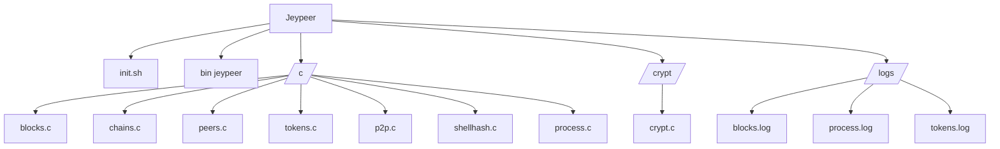

# Jeypeer
Jeypeer is a minimalist blockchain implementation with advanced cryptography and a simple P2P system for creating and sharing blocks. The project combines modern hashing with a lean C architecture, allowing for the exploration of blockchain concepts, event tokenization, and peer-to-peer communication in a direct and transparent way.


---

## Use without hesitation. 
Compile in [Jeypeer compile](https://github.com/Quikert/Jeypeer#compilation-and-use) or learn in [Jeypeer usage](https://github.com/Quikert/Jeypeer#what-does-this-do)

---

## Key features
- Minimalist Blockchain
  - Creation of genesis block
  - Adding new blocks with arbitrary data
  = Chain integrity verification

- Cryptography
  - Hashing via `sha256sum` integrated into the shell
  - Alternative with its own implementation in C
    
- Tokenization
  - Breakdown of events/processes into **tokens** and **logging**
 
- Peers
  - TCP server that receives blocks and adds them to the chain
  - Client that sends blocks to peers
 
- Logs
   - The following files are used for tracking: `blocks.log`, `process.log`, and `tokens.log`

- Safe cleaning
  - The `clean` command overwrites and removes local files with double confirmation
  
 ---

## Structure for fools

---

## Compilation and use
- Compile with a command: `cd Jeypeer && chmod a+x init.sh && ./init.sh`, the output should be something like:
```Shell
[Build] Compiling
[Init] Creatind 'Genesis block'
[Genesis] Chain exists
[Done] Usage ./jeypeer help
```
- All done!

---

## What does this do?

## Generics
Basic commands to initialize and interact with the blockchain.

#### Help
  Shows the list of available commands.  
  **Use:** `./jeypeer help`

#### Init
  Initializes the blockchain by creating the genesis block.  
  **Use:** `./jeypeer init`

#### ADD-Block
  Adds a new block to the chain with the specified data.  
  **Use:** `./jeypeer add-block "DATA"`

#### List
  Lists all blocks currently in the blockchain.  
  **Use:** `./jeypeer list`

#### Verify
  Verifies the integrity of the blockchain by checking hashes and order.  
  **Use:** `./jeypeer verify`

---

## Peers
Commands to manage peer connections.

#### Peers add
  Adds a peer address to the local peer list.  
  **Use:** `./jeypeer peers add 127.0.0.1:7000`

#### Peers rm
  Removes a peer address from the local peer list.  
  **Use:** `./jeypeer peers rm 127.0.0.1:7000`

#### Peers ls
  Lists all known peer addresses.  
  **Use:** `./jeypeer peers ls`

---

## Token and Server
Commands for tokenization and P2P networking.

#### Tokens and event
  Tokenizes the given event string and logs each token.  
  **Use:** `./jeypeer tokens "PROC|ID=42|STATE=RUNNING"`

#### P2P server
  Starts a TCP server to receive and append blocks from peers.  
  **Use:** `./jeypeer p2p server 7000`

#### P2P end
  Sends a block with the given data to a peer at the specified host and port.  
  **Use:** `./jeypeer p2p send 127.0.0.1 7000 "tx: alice->bob 10"`

#### Clean cache  
  Securely overwrites and deletes all local blockchain and log files (requires confirmation).  
  **Use:** `./jeypeer clean`

---

### Tested on


---

> Powered by @Quikert <3
>
